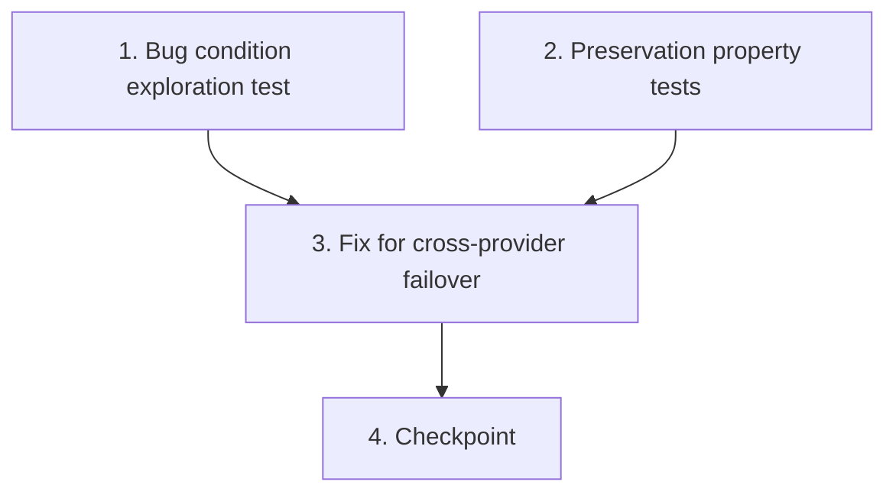

# Implementation Plan

## Overview

This task list implements a cross-provider failover mechanism for the `/ask` command in the Examen-planner bot. The bug causes the handler to show a generic error when the active AI provider fails, even though alternative providers with valid API keys are configured. The fix follows the exploratory bugfix workflow: write tests first to confirm the bug exists and capture baseline behavior, then implement the failover chain, and finally verify the fix passes all tests.

## Task Dependency Graph



```json
{
  "waves": [
    {"tasks": [1, 2]},
    {"tasks": [3]},
    {"tasks": [4]}
  ]
}
```

## Tasks

- [ ] 1. Write bug condition exploration test
  - **Property 1: Bug Condition** — Active Provider Fails With Alternatives Available
  - **CRITICAL**: This test MUST FAIL on unfixed code — failure confirms the bug exists
  - **DO NOT attempt to fix the test or the code when it fails**
  - **NOTE**: This test encodes the expected behavior — it will validate the fix when it passes after implementation
  - **GOAL**: Surface counterexamples that demonstrate the bot never tries alternative providers when the active one fails
  - **Scoped PBT Approach**: Scope the property to concrete failing cases: active provider throws `{status: 502}` for all keys while at least one other provider in `cfg` has valid API keys with openai_chat transport
  - Test that when `callStudyProvider(primaryProvider, messages)` throws `{status: 502}` AND `cfg.mistralApiKeys` / `cfg.cerebrasApiKeys` / etc. contain valid keys, the handler attempts those alternative providers and returns an answer (from Bug Condition in design: `isBugCondition` — primary fails, otherProviders.length > 0)
  - Mock `callStudyProvider` to throw `{status: 502}` for the primary provider. Configure `cfg` with keys for Mistral and Cerebras. Assert the handler returns an answer from a fallback provider rather than showing the generic error
  - Run test on UNFIXED code — expect FAILURE (handler shows "AI se jawab nahi aaya" without ever reading alternative provider keys)
  - **EXPECTED OUTCOME**: Test FAILS (this is correct — it proves the bug exists: the handler never constructs or calls alternative providers)
  - Document counterexamples found: handler only accesses `studyApiKeys` (mirror of active) and `groqApiKey`, never reads per-provider key fields like `mistralApiKeys`, `cerebrasApiKeys`
  - Mark task complete when test is written, run, and failure is documented
  - _Requirements: 1.1, 1.2, 1.3, 1.4_

- [ ] 2. Write preservation property tests (BEFORE implementing fix)
  - **Property 2: Preservation** — Non-Failover Path Behavior Unchanged
  - **IMPORTANT**: Follow observation-first methodology
  - **Observe on UNFIXED code**:
    - Observe: when primary provider succeeds, handler returns answer in standard format (question header + escaped HTML + 3500-char limit) without consulting other providers
    - Observe: when primary provider throws `{status: 400}`, handler immediately shows "AI ne yeh sawaal accept nahi kiya. Thoda chhota karke poocho." without retrying
    - Observe: when rate limit exceeded (>4 questions/minute), handler enforces limit before any provider call
    - Observe: when `cfg.enabled === false`, handler shows "AI abhi off hai"
    - Observe: when no providers have valid keys, handler shows "AI provider set nahi hai"
    - Observe: when `/ask` sent without a question, handler shows usage help message
  - Write property-based tests: for all inputs where the primary provider succeeds (or error is HTTP 400, or AI is disabled, or no keys exist, or no question provided), the handler output is identical to the current unfixed handler output (from Preservation Requirements in design)
  - Generate random `cfg` objects with subsets of provider keys, random questions, random success/400 responses — assert handler produces same output format, same error messages, same logging
  - Verify tests PASS on UNFIXED code (confirms baseline behavior is captured correctly)
  - **EXPECTED OUTCOME**: Tests PASS (this confirms baseline behavior to preserve)
  - Mark task complete when tests are written, run, and passing on unfixed code
  - _Requirements: 3.1, 3.2, 3.3, 3.4, 3.5, 3.6_

- [ ] 3. Fix for cross-provider failover in `/ask` handler

  - [ ] 3.1 Add `FAILOVER_PROVIDERS` constant to `bot/bot-server.js`
    - Define server-side provider registry array near the existing `studyProviderFromConfig` function
    - Each entry: `{ id, keyField, modelField, baseUrl, defaultModel }` for all OpenAI-compatible providers
    - Include: bynara, mistral, cerebras, openrouter, nvidia, google, hcnsec, bluesminds, aicampus, omniroute, kiro
    - Intentionally exclude `google_interactions` (transport !== openai_chat)
    - _Bug_Condition: isBugCondition(input) where primary fails AND otherProviders.length > 0_
    - _Expected_Behavior: system SHALL attempt next available configured provider_
    - _Preservation: Registry is only consulted when primary provider fails with non-400 error_
    - _Requirements: 2.1, 2.2, 2.3_

  - [ ] 3.2 Add `buildFallbackProviderList(cfg, excludeProvider)` function
    - Iterate `FAILOVER_PROVIDERS`, read keys from `cfg[entry.keyField]` using existing `studyApiKeyList()` helper
    - Skip entries with empty/whitespace-only keys
    - Skip the already-tried active provider (matched by comparing constructed URL to `excludeProvider.url`)
    - Build provider objects: `{ provider: entry.id, url: entry.baseUrl + '/chat/completions', keys, model }`
    - Use model from `cfg[entry.modelField]` or fall back to `entry.defaultModel`
    - Also include Groq fallback (via existing `groqFallbackProvider`) if not already the excluded provider
    - Return array of fallback provider objects in registry order
    - _Bug_Condition: isBugCondition(input) — this function enumerates the "otherProviders" that the original code never accessed_
    - _Expected_Behavior: returns all configured providers with valid keys excluding the failed primary_
    - _Preservation: function is only called after primary fails; does not alter primary provider selection_
    - _Requirements: 2.1, 2.2, 2.3, 2.4_

  - [ ] 3.3 Add `callWithFailover(providers, messages)` function
    - Accept array of provider objects and chat messages
    - Iterate providers in order, calling existing `callStudyProvider(provider, messages)` for each
    - If `callStudyProvider` returns an answer, return `{ answer, provider }`
    - If it throws with `status === 400`, re-throw immediately (bad question — retrying won't help)
    - If it throws with any other error (502, network failure, timeout), swallow and try next provider
    - If all providers exhausted, throw the last error (or `{status: 502}` if none)
    - _Bug_Condition: isBugCondition(input) — this function implements the missing failover loop_
    - _Expected_Behavior: returns first successful answer from any provider in the chain_
    - _Preservation: HTTP 400 still short-circuits immediately; successful first provider returns without trying others_
    - _Requirements: 2.1, 2.2, 2.3, 2.4, 2.5_

  - [ ] 3.4 Modify the `/ask` handler to use failover chain
    - Replace single-provider call with failover chain:
      - `primaryProvider = studyProviderFromConfig(cfg) || groqFallbackProvider(cfg)`
      - `fallbacks = buildFallbackProviderList(cfg, primaryProvider)`
      - If `!primaryProvider && fallbacks.length === 0` → show "AI provider set nahi hai" (unchanged)
      - `allProviders = primaryProvider ? [primaryProvider, ...fallbacks] : fallbacks`
      - `{ answer, provider } = await callWithFailover(allProviders, messages)`
    - Keep all existing pre-checks intact: rate limit, enabled check, no-question check
    - Keep answer formatting identical: question header, HTML escaping, 3500-char truncation
    - _Bug_Condition: isBugCondition(input) — handler now walks through all providers instead of giving up after one_
    - _Expected_Behavior: user receives answer from whichever provider succeeds first_
    - _Preservation: all pre-checks (rate limit, disabled, no question) execute before provider calls; primary provider is still tried first_
    - _Requirements: 2.1, 2.2, 2.3, 2.4, 2.5, 3.1, 3.2, 3.3, 3.4, 3.5, 3.6_

  - [ ] 3.5 Update success logging to include failover provider info
    - Log line: `console.log(\`✅ /ask → uid:${account.uid} via ${provider.provider}/${provider.model}\`)`
    - Uses the `provider` returned from `callWithFailover` — shows which provider actually answered
    - No functional change to user-facing behavior; improves admin observability
    - _Requirements: 2.5_

  - [ ] 3.6 Verify bug condition exploration test now passes
    - **Property 1: Expected Behavior** — Active Provider Fails With Alternatives Available
    - **IMPORTANT**: Re-run the SAME test from task 1 — do NOT write a new test
    - The test from task 1 encodes the expected behavior: when primary fails and alternatives exist, handler returns an answer from a fallback provider
    - When this test passes, it confirms the expected behavior is satisfied
    - Run bug condition exploration test from step 1
    - **EXPECTED OUTCOME**: Test PASSES (confirms bug is fixed — handler now tries alternative providers)
    - _Requirements: 2.1, 2.2, 2.3, 2.4, 2.5_

  - [ ] 3.7 Verify preservation tests still pass
    - **Property 2: Preservation** — Non-Failover Path Behavior Unchanged
    - **IMPORTANT**: Re-run the SAME tests from task 2 — do NOT write new tests
    - Run preservation property tests from step 2
    - **EXPECTED OUTCOME**: Tests PASS (confirms no regressions — primary success, HTTP 400, rate limiting, disabled AI, no keys, no question all behave identically)
    - Confirm all tests still pass after fix (no regressions introduced)
    - _Requirements: 3.1, 3.2, 3.3, 3.4, 3.5, 3.6_

- [ ] 4. Checkpoint — Ensure all tests pass
  - Run the full test suite to confirm both exploration and preservation tests pass
  - Verify no other bot commands are affected by the changes
  - Ensure all tests pass, ask the user if questions arise

## Notes

- The failover mechanism only activates when the primary provider fails with a non-400 HTTP error (e.g., 502, network timeout). HTTP 400 errors indicate a bad request and are not retried.
- Provider order in the failover chain follows the `FAILOVER_PROVIDERS` registry order. The primary (active) provider is always tried first.
- The `google_interactions` provider is excluded from the failover chain because it uses a different transport mechanism (not openai_chat compatible).
- All existing pre-checks (rate limiting, AI enabled check, question validation) remain unchanged and execute before any provider calls.
